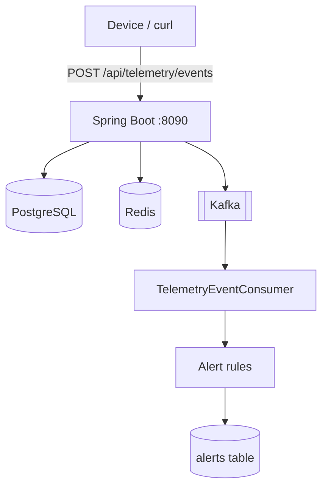
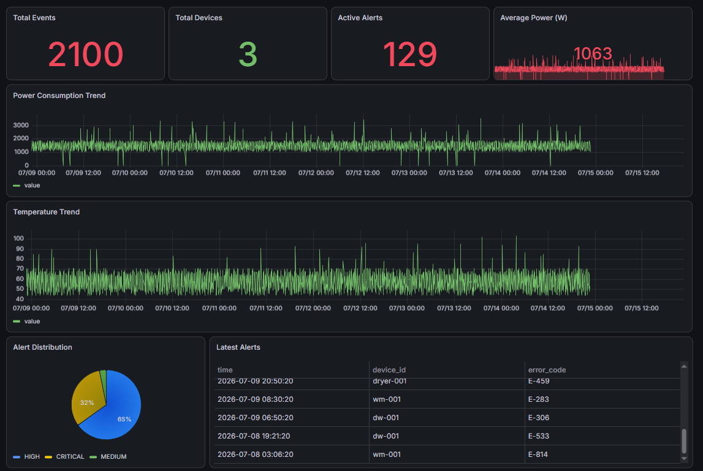

# Device Telemetry Service

[](https://github.com/burcinozkan/device-telemetry/actions/workflows/ci.yml)

HomeWhiz-style IoT telemetry backend for connected home appliances.

Devices send status/sensor events over HTTP. The service:
- persists history in **PostgreSQL**
- caches latest state in **Redis**
- streams events through **Kafka**
- evaluates anomaly rules and stores **alerts**

Built as a portfolio project demonstrating mobile-to-cloud IoT backend patterns.

---

## Architecture



| Store | Role |
|-------|------|
| PostgreSQL | Devices, telemetry history, alerts |
| Redis | Latest device state (`GET .../status`) |
| Kafka | Async alert processing |

---

## Tech stack

- Java 17, Spring Boot 4
- Spring Data JPA, Redis, Kafka
- PostgreSQL 16, Redis 7, Confluent Kafka
- springdoc OpenAPI (Swagger UI)
- Lombok, AssertJ

---

## Run locally

### 1. Infrastructure
```bash
docker compose up -d
```

Services:
- Postgres `localhost:5433`
- Redis `localhost:6380`
- Kafka `localhost:9092`
- Zookeeper `localhost:2181`

### 2. Application
```bash
mvn spring-boot:run
```

- API: http://localhost:8090  
- Swagger UI: http://localhost:8090/swagger-ui.html  
- OpenAPI JSON: http://localhost:8090/v3/api-docs  

### 3. Tests
```bash
mvn test
```

---

## API overview

| Method | Endpoint | Description |
|--------|----------|-------------|
| POST | `/api/devices` | Register device |
| GET | `/api/devices` | List devices |
| GET | `/api/devices/{deviceId}` | Get device |
| POST | `/api/telemetry/events` | Ingest telemetry (202) |
| GET | `/api/telemetry/devices/{deviceId}/status` | Latest state (Redis) |
| GET | `/api/telemetry/devices/{deviceId}/history` | Event history (PG) |
| GET | `/api/alerts` | Active alerts |
| GET | `/api/alerts/device/{deviceId}` | Alerts by device |
| POST | `/api/alerts/{alertId}/resolve` | Resolve alert |
| GET | `/api/dashboard/summary` | Fleet summary |

---

## Curl / PowerShell examples

### Register device
```powershell
$d = '{"deviceId":"wm-001","name":"Kitchen Washer","type":"WASHING_MACHINE","ownerId":"user-1","location":"Kitchen"}'
Invoke-RestMethod -Method Post -Uri http://localhost:8090/api/devices -ContentType "application/json" -Body $d
```

### Normal telemetry
```powershell
$t = '{"deviceId":"wm-001","eventType":"STATUS_UPDATE","deviceStatus":"RUNNING","powerWatts":1200,"doorOpen":false}'
Invoke-RestMethod -Method Post -Uri http://localhost:8090/api/telemetry/events -ContentType "application/json" -Body $t
```

### Trigger alerts (high power + door open)
```powershell
$t = '{"deviceId":"wm-001","eventType":"STATUS_UPDATE","deviceStatus":"RUNNING","powerWatts":3000,"doorOpen":true}'
Invoke-RestMethod -Method Post -Uri http://localhost:8090/api/telemetry/events -ContentType "application/json" -Body $t
Start-Sleep -Seconds 3
Invoke-RestMethod http://localhost:8090/api/alerts
```

### Status + history + dashboard
```powershell
Invoke-RestMethod http://localhost:8090/api/telemetry/devices/wm-001/status
Invoke-RestMethod "http://localhost:8090/api/telemetry/devices/wm-001/history?page=0&size=5"
Invoke-RestMethod http://localhost:8090/api/dashboard/summary
```

---

## Alert rules

| Rule | Condition | Severity |
|------|-----------|----------|
| HIGH_POWER_CONSUMPTION | powerWatts > 2500 | HIGH |
| DOOR_OPEN_WHILE_RUNNING | doorOpen + RUNNING | CRITICAL |
| OVER_TEMPERATURE | temperatureCelsius > 90 | HIGH |
| EXCESSIVE_WATER_USAGE | waterLiters > 80 | MEDIUM |
| DEVICE_ERROR_REPORT | ERROR_REPORT / errorCode | CRITICAL |

Thresholds are configurable in `application.yaml` under `telemetry.alerts`.

---

##  Grafana Dashboard

This project includes a pre-configured Grafana dashboard for monitoring telemetry data.

### Dashboard Features

-  Power Consumption Trend
-  Temperature Trend
-  Active Alerts
-  Total Events & Devices
-  Average Power
-  Latest Alerts

### Import Dashboard

1. Open Grafana
2. Go to **Dashboards → Import**
3. Upload:

```text
grafana/dashboards/device-telemetry-dashboard.json
```

or paste the dashboard JSON manually.

## Dashboard Preview




## Project structure

```
device-telemetry-service
│
├── README.md
├── docker-compose.yml
├── scripts/
│   └── populate-demo.ps1
├── grafana/
│   └── dashboards/
│       └── device-telemetry-dashboard.json
└── docs/
    ├── dashboard.png
   
```

---

## Ingest flow (sync + async)

1. Validate device exists  
2. Save `TelemetryEvent` to PostgreSQL  
3. Update device status  
4. Cache latest state in Redis  
5. Publish to Kafka  
6. Return `202 Accepted`  
7. Consumer analyzes rules → writes alerts  


